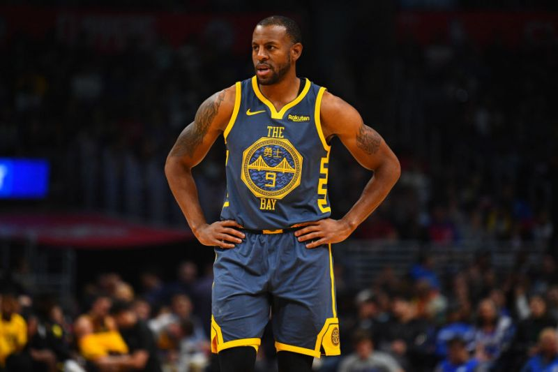
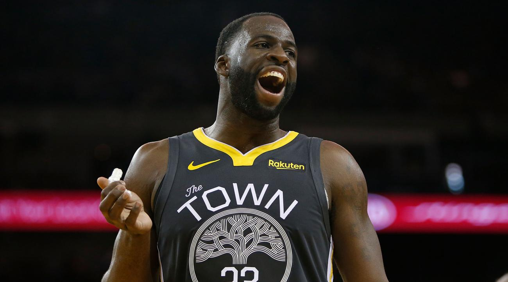
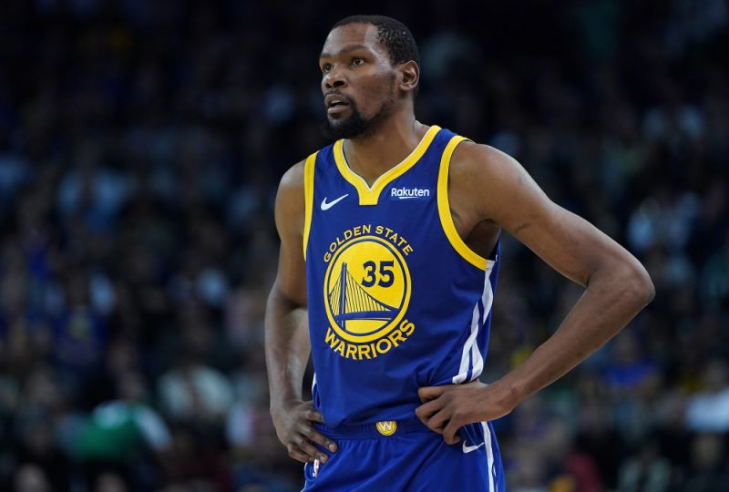
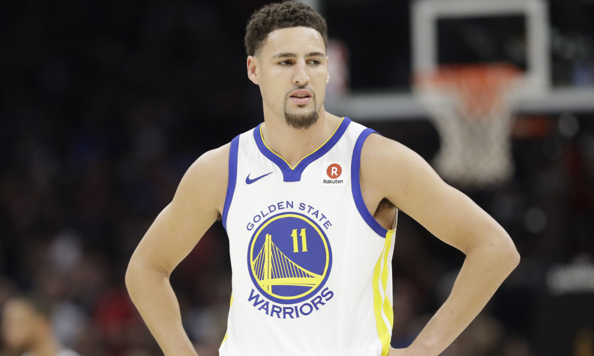
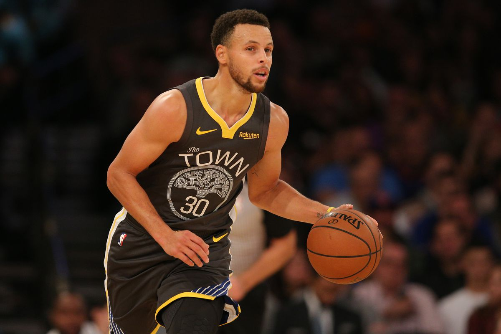
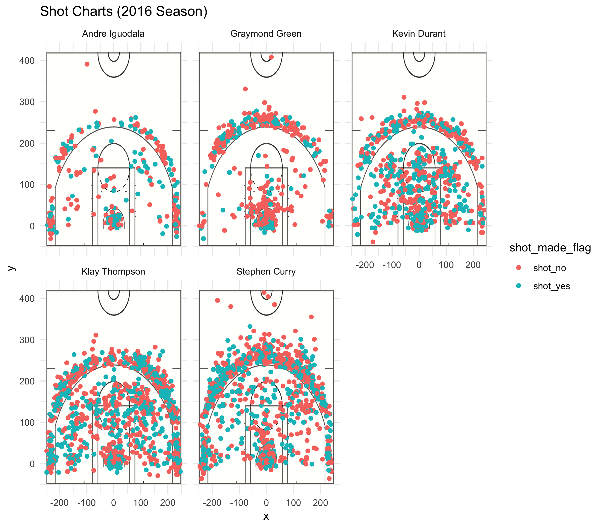
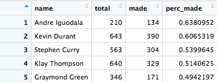
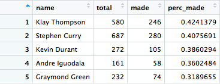
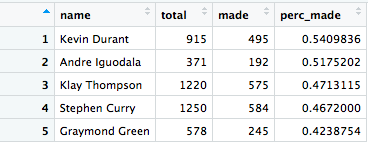

```{r setup, include=FALSE}
knitr::opts_chunk$set(echo = TRUE)
```

```{r, echo=FALSE}
url = "https://github.com/ucb-stat133/stat133-hws/raw/master/data/andre-iguodala.csv"
download.file(url = url, destfile = "andre-iguodala.csv")
dat <- read.csv("andre-iguodala.csv", stringsAsFactors = F)
url = "https://github.com/ucb-stat133/stat133-hws/raw/master/data/draymond-green.csv"
download.file(url = url, destfile = "draymond-green.csv")
dat <- read.csv("draymond-green.csv", stringsAsFactors = F)
url = "https://github.com/ucb-stat133/stat133-hws/raw/master/data/kevin-durant.csv"
download.file(url = url, destfile = "kevin-durant.csv")
dat <- read.csv("kevin-durant.csv", stringsAsFactors = F)
url = "https://github.com/ucb-stat133/stat133-hws/raw/master/data/klay-thompson.csv"
download.file(url = url, destfile = "klay-thompson.csv")
dat <- read.csv("klay-thompson.csv", stringsAsFactors = F)
url = "https://github.com/ucb-stat133/stat133-hws/raw/master/data/stephen-curry.csv"
download.file(url = url, destfile = "stephen-curry.csv")
dat <- read.csv("stephen-curry.csv", stringsAsFactors = F)
```


#Article: Analyzing and Comparing Shooting Statistics of Five Golden State Warriors Players

##Introduction and Motivation
  In this article, we will be analyzing the shooting statistics of 5 players of the Golden State Warriors team. These players are believed to be one of (if not the) best players on the team, so after our analysis we would like to discover if we can determine which shooting statistics lead these players to success, and what statistics make one player more successful over the other.

##Background
  First, let us examine our players. Our first player is Andre Iguodala. Andre Iguodala is a 35 year old, 6 foot 6, 215 lb Shooting Guard/Small Forward for the Golden State Warriors. He began his career in basketball in 2004, and joined the Golden State Warriors in 2013. 
  
```{r out.width="80%", echo=FALSE, fig.align="center"}

```

	Our second player is Draymond Green. Draymond Green is a 29 year old, 6 foot 7, 230 lb Power Forward for the Golden State Warriors. He joined the Golden State Warriors in 2012, beginning his career in basketball.
	
```{r out.width="80%", echo=FALSE, fig.align="center"}

```

	Our third player is Kevin Durant. Kevin Durant is a 30 year old, 6 foot 9, 240 lb Small Forward/Power Forward for the Golden State Warriors. He began his career in basketball in 2007, and joined the Golden State Warriors in 2016.
```{r out.width="80%", echo=FALSE, fig.align="center"}

```

	Our fourth player is Klay Thompson. Klay Thompson is a 29 year old, 6 foot 7, 215 lb Shooting Guard for the Golden State Warriors. He joined the Golden State Warriors in 2011, beginning his career in basketball.
	
```{r out.width="80%", echo=FALSE, fig.align="center"}

```

	Last but certainly not least, we have Stephen Curry, arguably the best player in the NBA right now. Stephen Curry is a 30 year old, 6 foot 3, 190 lb Point Guard for the Golden State Warriors. He joined the Golden State Warriors in 2011, beginning his career in basketball.
```{r out.width="80%", echo=FALSE, fig.align="center"}

```


  Now, before we begin our examination of the shooting statistics of these players, it is important to keep in mind the player specific characteristics described above. As one can imagine, the position a player may shoot from (for example) could depend largely on their physical structure as well as the position they play on the court. 

##Data
  The data we will be using for this project will be derived from 5 csv files, each corresponding to an individual player. These csv files contain data on every shot the player made in the 2016 season.
  
##Analysis Part I
  First, let us examine the distribution of player shots on the NBA court. This means we are examining where players typically shoot from, and what that might mean in terms of their game strategy.
	To examine this properly, we would like to generate a visual that can allow us to easily compare the positions from which each player shoots their shot. For further analysis, we will distinguish a shot as a hit or miss (to be defined as shot_yes an shot_no respectively). First, we will need to download an image of a typical basketball court. Then we will need to scale it according to the x and y coordinates of the shots described by our datasets. Finally, we will need to superposition each dataset (one corresponding to each individual player) onto this background. This will be done by creating a raster object on the court image and then generating a ggplot of the point distribution, distinguishing between and shot_yes and a shot_no by color. Once we have done this for each individual plot, we will combine and display all shot plots together as such.
```{r out.width="80%", echo=FALSE, fig.align="center"}

```

##Discussion Part I
  Let us now examine the significance of this image, which can be described as a facetted shot chart. The first major aspect we notice is that players such as Kevin Durant, Klay Thompson, and Stephen Curry have their data all over the court, whereas players like Andre Iguodala and Draymond Green have most of their data around the 3-point line or right up near the basket. If we go back to the descriptions of the players, we would see why this is the case. 
	Andre Iguodala is a shooting guard/small forward, which is reflected in our shot chart. Shooting guards tend to take longer shots, which would explain why a large amount of his shots are around the 3-point line. In addition, small forwards tend to move into the court, which would explain the few scatters on the court. 
	Draymond Green, on the other hand, is a power forward. Power forwards are part of what is called the ???inner players???. This means that he takes most of his shots up close the basket, which is clearly reflected in our plot. The other three players appear to play a more versatile approach to basketball, some even moving past the typical realm of their positions.
	Another interesting detail one might notice is that Kevin Durant, Klay Thompson, and Stephen Curry have much more data displayed than Andre Iguodala and Draymond Green. Why might this be the case? At first, one might be concerned that there is some discrepancy in the data collection, but upon a further analysis, it would be determined that this is not the case. Each data point represents a shot attempt. This means that the large amount of data displayed for these three players means that these players simply attempted to shoot more. This implies that these players simply might be more confident with their shot, suggesting that they are simply better shooters than the other two players. For players like Stephen Curry, this is no surprise.
	The last detail one might notice is that for every player, a large amount of their shot attempts are recorded right around the basket. With a little bit of research, one would see why this is the case. In basketball, the lay-up is one of the most popular ways to shoot a shot. This would explain why all players tend to have a lot of their data around the basket.
	
##Analysis Part II
  Now let us examine the effectiveness of players in their shooting abilities. For a best comparison of players, we will create tables containing the accuracy percentage (i.e. the percentage of the shots that go in) for each player. We will create 3 tables, one for 2-point field goals, one for 3-point field goals, and one for both types of shots. This will be obtained using the following code.

```{r, include=T}
library(dplyr)
shots <- read.csv("../data/shots-data.csv", stringsAsFactors = F)
two_point <- select(filter(shots, shot_type == "2PT Field Goal"), name, shot_made_flag)

two_points = two_point %>%
  group_by(name) %>%
  summarise(total = n(), made = sum(shot_made_flag == "shot_yes")) 
two_points <- arrange(mutate(two_points, perc_made = made/total), desc(perc_made))

three_point <- select(filter(shots, shot_type == "3PT Field Goal"), name, shot_made_flag)
three_points = three_point %>%
  group_by(name) %>%
  summarise(total = n(), made = sum(shot_made_flag == "shot_yes")) 
three_points <- arrange(mutate(three_points, perc_made = made/total), desc(perc_made))

overall <- select(shots, name, shot_made_flag)
overall_points = overall %>%
  group_by(name) %>%
  summarise(total = n(), made = sum(shot_made_flag == "shot_yes")) 
overall_points <- arrange(mutate(overall_points, perc_made = made/total), desc(perc_made))
```

```{r out.width="80%", echo=FALSE, fig.align="center"}

```


```{r out.width="80%", echo=FALSE, fig.align="center"}

```


```{r out.width="80%", echo=FALSE, fig.align="center"}

```


##Discussion Part II
  As one can see, the player with the highest 2-pointer percentage made is Andre Iguodala. This may, however, be misleading. Iguodala actually has the least number of shot attempts, which means the actual number of shots he makes is much less than the other players. It appears he takes his chances more carefully, thereby increasing is percentage made. 
	The player with the highest 3-pointer percentage made is Klay Thompson. Note how the percentages are much smaller for 3-pointer shots than for 2-pointer shots. This is likely because 3-pointer shots are typically more difficult to make than 2-pointers, which is why they are worth more points.
	The player with the highest percentage made overall is Kevin Durant. This is interesting, since Stephen Curry is typically viewed as the best player of the Golden State Warriors. But again, upon further scrutiny one would notice that Curry makes more shot attempts than Durant, thereby making the actual number of shots he makes higher than Durant.
	
##Conclusion
  The object of this investigation was to compare shooting statistics of these players and see which might suggest better player performance from the team. In the first part of this investigation, we found that players that tend to play a more versatile position on the court tend to attempt more shots, which correlated to a larger number of points scored for the team. In the second part, we discovered that higher percentage made (i.e. the accuracy of the players) did not necessarily mean a given player was better. In determining the positive benefit an individual player has on team, one might view this simply my how many points they score. If this is the case, then players that make more attempts, even if they make fewer in, may make a larger contribution to their team than others.

